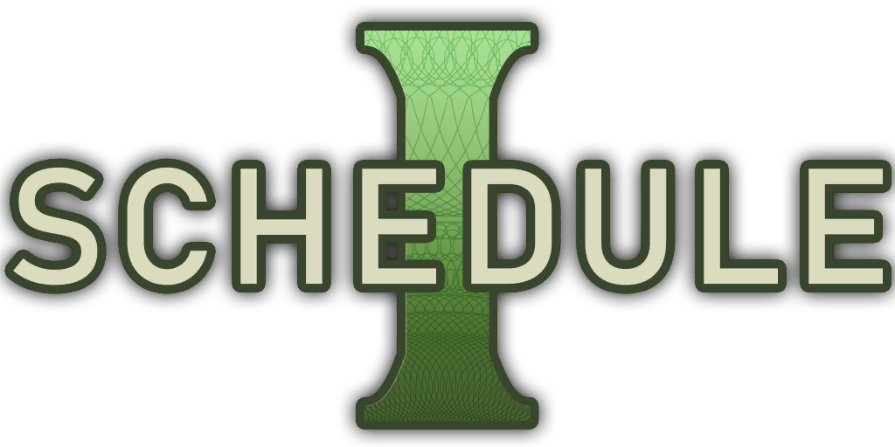

<p align="center">
  
</p>

# MeshLoader

MeshLoader is a lightweight C# library designed for MelonLoader mods, allowing you to load custom 3D meshes and textures from base64-encoded strings in Unity games. The library uses Unity's Universal Render Pipeline (URP) to apply textures and provides two simple static methods to load a `Mesh` and a `Material` with a custom texture, making it easy to add dynamic assets to your MelonLoader mods.

**Note**: MeshLoader is built for MelonLoader mods and currently supports URP only. Support for other render pipelines may be added in future updates.

## Features
- Load 3D meshes from base64-encoded OBJ files.
- Load textures from base64-encoded images (e.g., PNG, JPEG) and apply them to a URP/Lit material.
- Lightweight and easy to integrate into MelonLoader mods.
- Error handling with detailed logging for debugging via MelonLoader.

## Installation

### Prerequisites
- **MelonLoader**: Install [MelonLoader](https://melonloader.com/) (version 0.5.x or 0.6.x recommended). Follow their [installation guide](https://melonwiki.xyz/#/README?id=how-to-install-melonloader) for setup.
- **Game with URP**: Ensure the Unity game you're modding uses the Universal Render Pipeline (URP).
- **.NET Framework**: The library is built with .NET Framework for Unity/MelonLoader compatibility.

### Steps
1. **Download the DLL**:
   - Download `MeshLoader.dll` from the [Releases](https://github.com/YourUsername/MeshLoader/releases) page of this repository.

2. **Add to Your MelonLoader Mod**:
   - Place `MeshLoader.dll` in the `Plugins` folder of your game directory (e.g., `GameFolder/Plugins/MeshLoader.dll`).
   - Alternatively, if your mod has its own folder (e.g., `GameFolder/Mods/YourMod`), place it in `GameFolder/Mods/YourMod/Plugins/MeshLoader.dll`.

3. **Verify Setup**:
   - Run your game with MelonLoader and check the MelonLoader log (`GameFolder/MelonLoader/Latest.log`) to ensure the DLL loads without errors.

## Usage

MeshLoader provides two static methods under the `MeshLoader` namespace: `GetCustomMesh` and `GetCustomTexture`. These methods allow you to load a mesh and a material with a custom texture directly from base64 strings in your MelonLoader mod.

### Example: Loading a Mesh and Texture in a MelonLoader Mod
Below is an example of how to use MeshLoader in a MelonLoader mod to load a custom mesh and texture into a scene:

```csharp
using MelonLoader;
using UnityEngine;
using MeshLoader;

public class MyMod : MelonMod
{
    public override void OnSceneWasLoaded(int buildIndex, string sceneName)
    {
        MelonLogger.Msg($"Scene: {sceneName} Was Loaded");

        if (sceneName == "Menu")
        {
            // Replace these with your actual base64-encoded strings
            string base64Mesh = "/* Your base64-encoded OBJ string */";
            string base64Texture = "/* Your base64-encoded image string */";

            // Load the mesh and material
            Mesh mesh = MeshLoaderUtility.GetCustomMesh(base64Mesh);
            Material material = MeshLoaderUtility.GetCustomTexture(base64Texture);

            if (mesh != null && material != null)
            {
                // Create a GameObject to display the mesh
                GameObject meshObject = new GameObject("CustomMesh");
                meshObject.layer = LayerMask.NameToLayer("Default");
                MeshFilter meshFilter = meshObject.AddComponent<MeshFilter>();
                MeshRenderer meshRenderer = meshObject.AddComponent<MeshRenderer>();
                meshFilter.mesh = mesh;
                meshRenderer.material = material;

                MelonLogger.Msg("Custom mesh and material loaded successfully!");
            }
            else
            {
                MelonLogger.Msg("Failed to load mesh or material.");
            }
        }
    }
}
```

## API Reference

### `MeshLoaderUtility.GetCustomMesh(string base64)`
- **Description**: Loads a 3D mesh from a base64-encoded OBJ file string.
- **Parameters**:
  - `base64`: A base64-encoded string representing an OBJ file.
- **Returns MAYBE add a link to a video showing how to get base64 string of a file.
- **Returns**:
  - `UnityEngine.Mesh`: The loaded mesh, or `null` if an error occurs.
- **Example**:
  ```csharp
  Mesh mesh = MeshLoaderUtility.GetCustomMesh("YourBase64String");
  if (mesh != null)
  {
      MelonLogger.Msg("Mesh loaded successfully!");
  }
  ```

### `MeshLoaderUtility.GetCustomTexture(string base64)`
- **Description**: Loads a texture from a base64-encoded image (e.g., PNG, JPEG) and applies it to a URP/Lit material.
- **Parameters**:
  - `base64`: A base64-encoded string representing an image file.
- **Returns**:
  - `UnityEngine.Material`: A material with the "Universal Render Pipeline/Lit" shader and the loaded texture applied, or `null` if an error occurs. Falls back to the "Standard" shader if URP/Lit is unavailable.
- **Example**:
  ```csharp
  Material material = MeshLoaderUtility.GetCustomTexture("YourBase64Texture");
  if (material != null)
  {
      MelonLogger.Msg("Material with texture loaded successfully!");
  }
  ```

## Limitations
- Designed specifically for **MelonLoader mods**; not intended for standalone Unity projects.
- Currently supports **Universal Render Pipeline (URP)** only. If URP is not set up in the game, the library falls back to the "Standard" shader, which may not render correctly.
- The OBJ parser assumes a basic format (vertices, UVs, and faces). Complex OBJ features (e.g., materials, smoothing groups) are not supported.
- Base64 strings must be valid and correctly encoded (OBJ for meshes, image formats like PNG/JPEG for textures).

## Troubleshooting
- **DLL Not Found**: Ensure `MeshLoader.dll` is in the correct folder (`GameFolder/Plugins` or `GameFolder/Mods/YourMod/Plugins`).
- **TypeLoadException**: Verify the DLL name (`MeshLoader.dll`, no spaces) and ensure the namespace (`MeshLoader`) is correctly imported.
- **Shader Issues**: Confirm the game you're modding uses URP. If the "Universal Render Pipeline/Lit" shader is not found, check the game's render pipeline setup.
- **MelonLoader Logs**: Check `GameFolder/MelonLoader/Latest.log` for detailed error messages.

## Contributing
Contributions are welcome! If you'd like to add support for other render pipelines, improve the OBJ parser, or fix bugs, please:
1. Fork the repository.
2. Create a new branch (`git checkout -b feature/YourFeature`).
3. Commit your changes (`git commit -m "Add your feature"`).
4. Push to the branch (`git push origin feature/YourFeature`).
5. Open a Pull Request.

## License
This project is licensed under the MIT License. See the [LICENSE](LICENSE) file for details.

## Acknowledgments
- Thanks to [MelonLoader](https://melonloader.com/) for providing an excellent modding framework for Unity games.
- Built with love for the MelonLoader modding community! ❤️